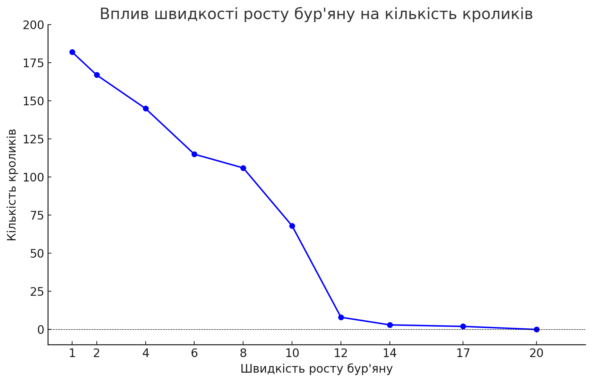

# Комп'ютерні системи імітаційного моделювання
### Виконав студент групи СПм-23-5 Дяченко Максим Сергійович
### Лабораторна робота №2. Редагування імітаційних моделей у середовищі NetLogo"

### Варіант 6, модель у середовищі NetLogo

[Rabbits Grass Weeds](https://www.netlogoweb.org/launch#https://www.netlogoweb.org/assets/modelslib/Sample%20Models/Biology/Rabbits%20Grass%20Weeds.nlogo) - моделювання екосистеми, що складається з кроликів, трави і бур'янів

### Оновлення логіки моделі

Код моделі було відредаговано, щоб логіка відповідала вимогам варіанту:
- Бур'яни можуть бути отруйними. Додано керуючий параметр `poison-probability` (0-100) шо відповідає за вірогідність кролика отруїтись бур'яном і захворіти; Протягом трьох тактів кролик не може рухатись, харчуватись і розмножчуватись. Хворі кролики позначаються червоним кольором.

- Кролики тепер поділені на самців та самок (внутрішній параметр `gender` у `rabbits-own`). Тепер для розмноження потрібно, що у кролика був кролик у сусідній клітинці протилежної статі, щоб обидва кролики були здорові і мали достатньо енергії для розмноження.

- **На власний розсуд** було додано наступну логіку: кролики, що захворіли тепер будуть втрачати втричі більше енергії, ніж здорові кролики.

```
breed [rabbits rabbit]
rabbits-own [ energy gender sick ticks-sick ]

to setup
  clear-all
  grow-grass-and-weeds
  set-default-shape rabbits "rabbit"
  create-rabbits number [
    set color white
    setxy random-xcor random-ycor
    set energy random 10  ;start with a random amt. of energy
    set sick false ; всі кролики на початку здорові
    set ticks-sick 0 ; лічильник тривалості хвороби
    set gender one-of ["male" "female"] ; стать для кроликів буде вибиратись випадковим чином
  ]
  reset-ticks
end

to go
  if not any? rabbits [ stop ]
  grow-grass-and-weeds
  ask rabbits
  [
    if not sick
    [
    	move
      eat-grass
      eat-weeds
      reproduce
    ]

    if sick
    [
     	set ticks-sick ticks-sick + 1
      set energy energy - 1.5
      if ticks-sick >= 3 [ recover ]
    ]

    death
  ]
  tick
end

to grow-grass-and-weeds
  ask patches [
    if pcolor = black [
      if random-float 1000 < weeds-grow-rate
        [ set pcolor violet ]
      if random-float 1000 < grass-grow-rate
        [ set pcolor green ]
  ] ]
end

to move  ;; rabbit procedure
  rt random 50
  lt random 50
  fd 1
  ;; moving takes some energy
  set energy energy - 0.5
end

to eat-grass  ;; rabbit procedure
  ;; gain "grass-energy" by eating grass
  if pcolor = green
  [ set pcolor black
    set energy energy + grass-energy ]
end

to eat-weeds  ;; rabbit procedure
  ;; gain "weed-energy" by eating weeds
  if pcolor = violet
  [ set pcolor black
    set energy energy + weed-energy
    if random-float 100 < poison-probability [
     	set sick true
      set color red ;; Кролик захворів, тому змінює свій колір
    ]
  ]
end

to reproduce     ;; rabbit procedure
  ;; give birth to a new rabbit, but it takes lots of energy
  if energy >= birth-threshold
  [
    let nearby-rabbit one-of (turtles-on neighbors) with [
      breed = rabbits
      and gender != [gender] of myself
      and energy > birth-threshold
      and not sick
    ] ;; Кролик поблизу здоровий, протилежного полу і готовий розмножуватись

    if nearby-rabbit != nobody
    [
      if random 100 < 50
      [
        set energy energy / 2
        hatch 1 [ fd 1 ]
        ask nearby-rabbit [ set energy energy / 2 ]
      ]
    ]
  ]
end

to death     ;; rabbit procedure
  ;; die if you run out of energy
  if energy < 0 [ die ]
end

to recover
  ;; Команда одужання кролика (після трьох тактів)
  set sick false
  set ticks-sick 0
  set color white
end
```

## Обчислювальний експеримент

### 3. Вплив появи бур'янів на популяцію кроликів

В даному експерименті буде продемонстровано, як поява бур'янів і швидкість їх росту впливає на розмноження кроликів. Справедливо, що бур'ян буде заважати росту трави, і коли кролики з'їдатимуть бур'ян, вони не будуть отримувати енергії (стандартне значення параметру `weed-energy` - 0). Кількість симуляцій - 10. Кількість кроликів (параметр `number`) - 50. Всі інші параметри - встановлені за замовчуванням.

На відміну від аналогічного експерименту в першому варіанті, в даному випадку було додано нову логіку і параметр `poison-probability`.

Симуляція буде тривати протягом близько 500 тактів.

- `birth-threshold` - 15;
- `poison-probability` - 75;
- `grass-grow-rate` - 15;
- `grass-energy` - 5;
- `weed-energy` - 0;

| Швидкість росту бур'яну | Кількість кроликів |
| ----------------------- | ------------------ |
| 1                       | 182                |
| 2                       | 167                |
| 4                       | 145                |
| 6                       | 115                |
| 8                       | 106                |
| 10                      | 68                 |
| 12                      | 8                  |
| 14                      | 3                  |
| 17                      | 2                  |
| 20                      | 0                  |



По даному графіку видно, що нова логіка додала більше сенсу в появу бур'янів і якщо раніше бур'яни практично не впливали на популяцію кроликів, то тепер вони є для них небезпечними через можливість отруїтись ними. Тож тепер, чим більше бур'янів виростає, тим більше кроликів хворіє, тим меншою стає їх популяція.
